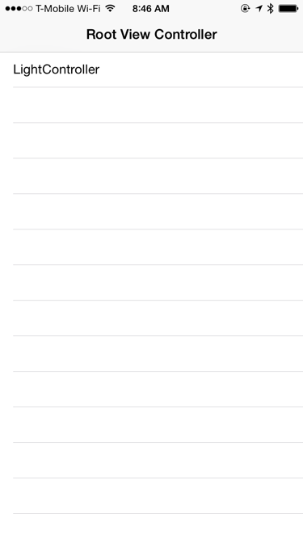

# Building a Custom iOS-Controlled Lighting System

I recently moved into a new apartment. It's a great place, except for one glaring omission: the built-in desk area has terrible light. I looked online a bit, and discovered that there are excellent LED strip lights that would fit under an overhanging shelf and illuminate the desk beatifully. 

But I am an Engineer! And Engineers love to build stuff! I decided the preferable course would be to create my own lighting system. With LEDs that can display custom colors. And make it controlled by iOS. 

More expensive, harder to build, and probably won't work as well? NOW WE'RE TALKING!

Because I've done most of my hobby electronics work on the [Arduino](http://arduino.cc), I decided to use one of those as the controller for the project. I'd recently learned about the [LightBlue Bean](https://punchthrough.com/bean/), a super-cool Arduino controller that adds Bluetooth 4.0 to the standard Arduino formula. The Bluetooth support would allow it to easily talk with an iOS or Android phone. (Android support is left as an exercise to the reader, because I don't know how to do it.) The [NeoPixel](http://www.adafruit.com/category/168) LEDs work well, and since you can wire a ton of them in serial, keep the wiring hassle to a minimum. And since the LEDs won't run long on battery power, a 3v power supply:

Thus, our parts list:

- [Adafruit NeoPixel Digital RGB LED Strip - White 30 LED - 1m](http://www.adafruit.com/products/1376)
- [LightBlue Bean](https://punchthrough.com/bean/)
- 3v Power Supply
- Pushbutton Switch
- Wires and solder and all that stuff

In addition, since we'll be making an iOS app to control the project, we'll need Xcode and an iPhone. (The simulator won't be much use, since we'll need the Bluetooth support.)

## Step 1: Wire Up the Parts

We don't want to have to be replacing batteries all the time, so an external power supply seems the way to go. There's one potentially tricky problem here: the NeoPixel strip expects 5v, and the Bean runs at 3.3v. Fortunately, per ["Powering the NeoPixel"](https://learn.adafruit.com/adafruit-neopixel-uberguide/power), "Lower voltages are always acceptable, with the caveat that the LEDs will be slightly dimmer." Dimmer is OK; having our project catch fire and burn the apartment to the ground (which would probably ensure I wouldn't get my damage deposit back) is not. Thus, we'll use a 3v external supply.

We'll also put another safety measure in place: a 1000Ω resistor between the control board and the strip's data pin. (The NeoPixel folks [recommend 300-500Ω]( https://learn.adafruit.com/adafruit-neopixel-uberguide/best-practices), but I didn't have one in that range, and the higher resistance does no harm.)

With all that in mind, here's what our final wiring diagram ends up looking like:

## Step 2: The Arduino Software

(Note: you can download the completed software for this project [from GitHub](https://github.com/SeanMcTex/iOSBluetoothLighting).)

The Bean's software supports communicating over Bluetooth two different ways: using a virtual wireless serial port (already familiar to anyone who has done much Arduino work), and through five "Scratch" Bluetooth Low Energy characteristics. Each of these is a 20 byte section of memory, the values of which can be set and read through standard Bluetooth LE protocols.

For our project, we'll need to communicate four bytes of information: the on/off status for the light strip, and a byte each for red, green and blue color values. Since the payload is small and predictably structured, we'll use the first four bytes of one of the scratch characteristics to store the data:

Once we've determined how we're going to be receiving the data on the Bean, the main loop becomes straightforward:

	void loop() 
	{
	  ScratchData thisScratch = 
	    Bean.readScratchData(1);

	  if ( thisScratch.length >= 4 ) {
	    bool isOn = thisScratch.data[0];
	    int r = thisScratch.data[1];
	    int g = thisScratch.data[2];
	    int b = thisScratch.data[3];

	    updateLight( isOn, r, g, b ); // more on this in a minute

	  }

	  Bean.sleep(1000);
	}  

In the first line, we use the Bean library to read the data from the frist Scratch area. After verifying the we have enough data to break apart, we extract the values for whether the light should be on and each of the color channels and then pass them off to a yet-to-be-written routine for updating our lights. Finally, we use the Bean library's sleep command to put the controller to sleep for one second. (The Bean library's [sleep command](https://punchthrough.com/bean/the-arduino-reference/sleep/) puts the microcontroller into "deep sleep" mode, and is more power-efficient than the standard one.)

	void updateLight( bool isOn, int r, int g, int b ) {
	  uint32_t c = strip.Color( r, g, b );
	  if ( isOn ) {
	    colorWipe( c, 50 );
	  } 
	  else {
	    colorWipe( strip.Color( 0, 0, 0 ), 50 );
	  }
	}

	// Fill the dots one after the other with a color
	void colorWipe(uint32_t c, uint8_t wait) {
	  for( uint16_t i=0; i<strip.numPixels(); i++ ) {
	    strip.setPixelColor( i, c );
	    strip.show();
	    delay( wait );
	  }
	}

In our next section of code, we have an updateLight method that either sets all the lights on the NeoPixel strip to the specified color or turns them all off. In order to have the lights appear sequentially, rather than all at once, we borrow the colorWipe method from some of the sample code that is provided with the NeoPixels. (This is, of course, just for a bit of sci-fi flair -- we could easily have them all come on at once.)

## Step 3: The iOS Software

Since we're a mobile shop, it would seem silly not to write our own custom software to control the project. The only UI we'll need for this is a way to select a Bean, an on/off switch, and a way to specify the color:

We'll also include the LightBlue Bean's [iOS/OS X SDK](https://github.com/PunchThrough/Bean-iOS-OSX-SDK), which makes working with the Bean a little easier. Since we are using Bluetooth characteristics to send our data, we could also simply use CoreBluetooth, though including the SDK gives us the flexibility to also take advantage of the Bean's serial connection in the future if we want to.

When the browser for available Beans appears, we use the Bean library to scan for available devices:

	- (void)viewDidLoad {
	    [super viewDidLoad];
	    self.beanManager = [[PTDBeanManager alloc] initWithDelegate:self];
	}

	-(void)viewDidAppear:(BOOL)animated {
	    // call will fail if we don't give Bluetooth a bit of time to spin up
	    dispatch_after(dispatch_time(DISPATCH_TIME_NOW, (int64_t)(1 * NSEC_PER_SEC)), dispatch_get_main_queue(), ^{
        
	        NSError *error;
	        if ( self.currentBean != nil ) {
	            [self.beanManager disconnectBean:self.currentBean error:nil];
	            self.currentBean = nil;
	        }
	        self.beanArray = [NSMutableArray array];
	        [self.tableView reloadData];
        
	        [self.beanManager startScanningForBeans_error:&error];
	        if ( error != nil ) {
	            NSLog(@"Error scanning for beans: %@", error );
	        }
        
	    });
	}

Note one potential pitfall: when we create a *PTDBeanManager*, we have to give it a little bit of time to get the Bluetooth radio online -- otherwise scanning will fail with an error.

When the Bean manager calls our delegate method to indicate that it found a Bean, we simply add it to our array and update the table to reflect the new device:

-(void)beanManager:(PTDBeanManager *)beanManager didDiscoverBean:(PTDBean *)bean error:(NSError *)error {
    [self.beanArray addObject:bean];
    [self.tableView reloadData];
}

If the user taps a bean to select it, we then try to establish a connection:

	-(void)tableView:(UITableView *)tableView didSelectRowAtIndexPath:(NSIndexPath *)indexPath {
	    PTDBean *bean = [self.beanArray objectAtIndex:indexPath.row];
	    [self.beanManager connectToBean:bean error:nil];
	    NSLog(@"Connecting to bean: %@", bean.name);
	}

And when the connection is made, we finally initiate the segue to show the controls for the bean:

	-(void)beanManager:(PTDBeanManager *)beanManager didConnectBean:(PTDBean *)bean error:(NSError *)error {
	    [self performSegueWithIdentifier:@"showBeanSegue" sender:nil];
	}

Most of the control panel code just deals with UI. The interesting methods allow us to send an update, with a little bit of data massaging, to the Bean.

	- (void)sendUpdateToBean {
	    CGFloat red;
	    CGFloat green;
	    CGFloat blue;
	    CGFloat alpha;
	    [self.colorSwatchView.backgroundColor getRed:&red green:&green blue:&blue alpha:&alpha];
    
	    Byte redByte = floor( red * 255 );
	    Byte greenByte = floor( green * 255 );
	    Byte blueByte = floor( blue * 255 );
    
	    Byte dataArray[4];
	    dataArray[0] = self.onOffSwitch.on;
	    dataArray[1] = redByte;
	    dataArray[2] = greenByte;
	    dataArray[3] = blueByte;
    
	    NSData *payload = [NSData dataWithBytes:dataArray length:sizeof(dataArray)];
	    [self.bean setScratchBank:1 data:payload];
	}

We also read the data from the bean when we display the screen to set the status of the UI appropriately:

	- (void)viewDidLoad {
	    [super viewDidLoad];
	    ...    
	    self.bean.delegate = self;
	    [self.bean readScratchBank:1];
	}

	- (void)bean:(PTDBean *)bean didUpdateScratchBank:(NSInteger)bank data:(NSData *)data {
	    Byte dataArray[4];
	    [data getBytes:&dataArray length:4];
    
	    BOOL isOn = dataArray[0];
	    Byte redByte = dataArray[1];
	    Byte greenByte = dataArray[2];
	    Byte blueByte = dataArray[3];
    
	    CGFloat red = redByte / 255.0;
	    CGFloat green = greenByte / 255.0;
	    CGFloat blue = blueByte / 255.0;
    
	    UIColor *color = [UIColor colorWithRed:red green:green blue:blue alpha:1];
    
	    self.onOffSwitch.on = isOn;

	    self.colorSwatchView.backgroundColor = color;

	    self.redSlider.value = red;
	    self.greenSlider.value = green;
	    self.blueSlider.value = blue;
	}

## Step 4: Profit?

